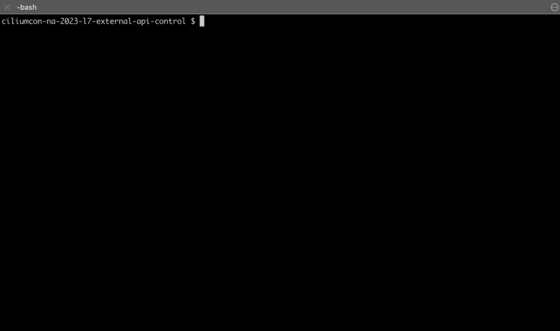
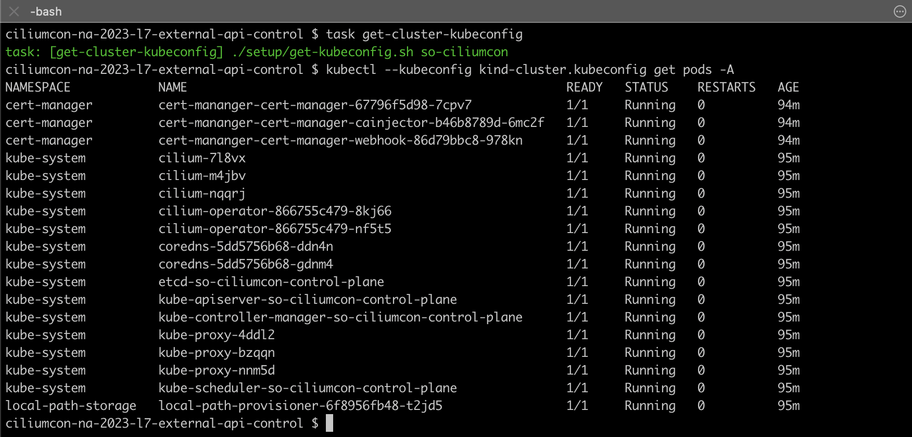
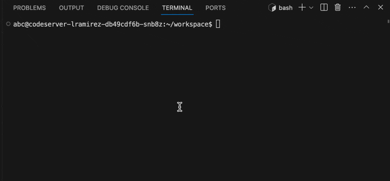

# ciliumcon-na-2023-l7-external-api-control

This is the companion repository to the [Controlling Access To External APIs With Cilium][1] 
presentation that was given at CiliumCon NA 2023 held in Chicago, IL.

This repository contains scripts and manifests that will do the following:

1. Create a Kind cluster with a local registry configured, and cilium and
   cert-manager already installed
2. Build a certificate generation docker image and push it to the local
   registry
3. Deploy the codeserver workload, alongside an L7 Cilium Network Policy and a
   certificate generation Job that will generate the terminating and 
   originating TLS certificates for the policy to use

The goal of the repo is to allow you to play around with Cilium and its
flexible API and learn a little bit more about how it works, and how you
could use it in your organization.

[1]: https://colocatedeventsna2023.sched.com/event/1Rj1R/controlling-access-to-external-apis-with-cilium-luis-ramirez-superorbital

## Pre-requisites

You will need the following tools installed in your computer before running the demo:
 - [Docker](https://docs.docker.com/get-docker/)
 - [Taskfile](https://taskfile.dev/installation/)
 - [Kind](https://kind.sigs.k8s.io/)
 - [Kubectl](https://kubernetes.io/docs/tasks/tools/#kubectl)
 - [Helm](https://helm.sh/docs/intro/install/)
 - [Cilium CLI](https://docs.cilium.io/en/stable/gettingstarted/k8s-install-default/#install-the-cilium-cli)

## Usage

The Kind cluster can bootstrapped by running the following task at the root of
the repo:

```sh
task create-cluster
```

This will create the Kind cluster, a local container registry, and install
cilium and cert-manager in the cluster:


After this is done, you can retrieve the kubeconfig for the cluster using the command

```sh
task get-kubeconfig
```

which will create a `kind-cluster.kubeconfig` file that you can use to talk to
your cluster:


Feel free to play around with this cluster! When you're ready, we'll start to
deploy all the resources.

## Setup

### Generating certificates

Before we can create the workload and deploy the PKI material to the cluster,
we need to build the container that will run the [certificate generation][2]
script. To do this, we'll use the provided task:

```sh
task build-certificate-generation
```

This will build the image using the provided [Dockerfile][3], and push the
image to the local container registry that our cluster is connected to.

[2]: ./certificate-generation/generate.sh
[3]: ./certificate-generation/Dockerfile

This script will create an interception certificate that is valid for the
`github.com` domain, although additional Subject Alternate Names (SANs) can be
added by modifying the [environment variables][4] on the Job itself.

[4]: ./kustomize/certificates/job.yaml

### Inspecting the Network Policy

By default, the certificates and the workloads are deployed in the `students`
namespace. By [inspecting the so-github-access][5] policy, you can see how it
targets our codeserver workloads, how it only allows access to the superorbital
organization in GitHub, and how it uses the originating and terminating
certificates in the same namespace.

[5]: ./kustomize/policies/policy.yaml

### Installing workloads

Finally, we can deploy the certificates, the policies and the codeserver
instance with the provided task command:

```sh
task install
```

You can port-forward the codeserver instance to your browser by a simple
kubectl command:

```sh
kubectl --kubeconfig kind-cluster.kubeconfig port-forward -n students service/codeserver-lramirez 8443:8443
```

And then finally, try to clone any repo that's not in the superorbital
organization and watch it be rejected:


### Cleanup

The workloads, certificates and policy can be removed by running:
```sh
task uninstall
```

To clean up the cluster and the local registry:

```sh
task cleanup-cluster
```
